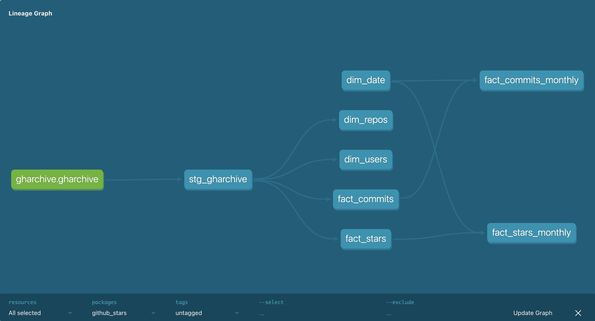

# Overview
This project aims to measure stars and commits of all Github repositories. The goal is to be able to identify fast growing repositories as well as analyze a specific repository. The data is delivered in the format of a SQL database which updates at a daily frequency.

# Lineage Graph


Graph showing the DBT directed acyclic graph.

# Metrics

The metrics/data points we analyze are as follows:

1. Growth rate of stars
2. Growth rate of commits
3. Custom analysis

The growth rate of stars and growth rate of commits are the metrics we will use to decide which repositories are growing the fastest. The final product also needs to have the functionality to conduct Ad hoc custom analysis for more specific, tailored exploration.

# Data Source
The choice for the data source was between the Github API and GH Archive.

### Github API
#### Pros:
* Live, fresh data
* No 3rd party involved
  
#### Cons:
* Complex load logic; we would exceed the alotted number of API calls

### GH Archive
#### Pros:
*  Simple load logic; it is easier for us to gather all the necessary data

#### Cons:
*  Refreshes every hour (not the most up-to-date data)
*  3rd party is involved

Ultimately, we chose our data source to be GH Archive due to the feasibility issue that the Github API introduces. As we only need the data to be updated daily, the refresh frequency of 1 hour is acceptable. The potential issues that could arise due to the fact that the data is from a 3rd party can be mitigated with data quality tests.

# Models

For this project we will be using the Kimball Model. It is a framework to designing data structures which construct several star schemas to fulfill various reporting needs. The Kimball Model can be broken down into three aspects:
* Facts: the measurements that result from a business process event (almost always numeric)
* Dimensions: the information that provides who, what, where, when, why, and how context
* The grain: establishes what a single fact table row represents

### Facts and Dimensions Models
#### Fact Tables
* `fact_stars`
  * `event_id`
  * `repo_id`
  * `user_id`
  * `event_date`
* `fact_commits`
  * `event_id`
  * `repo_id`
  * `user_id`
  * `event_date`

#### Dimension Tables
* `dim_repositories`
  * `repo_id`
  * `repo_name`
  * `owner_login`
* `dim_users`
  * `user_id`
  * `login`

 
### Sample SQL Code for Common Use Cases
#### Stars:
```
SELECT month, yoy_growth

FROM fact_repo_stars_monthly

WHERE repo_name = "plotly/plotly.py";
```

#### Commits:
```
SELECT month, yoy_growth

FROM fact_repo_commits_monthly

WHERE repo_name = "plotly/plotly.py";
```
